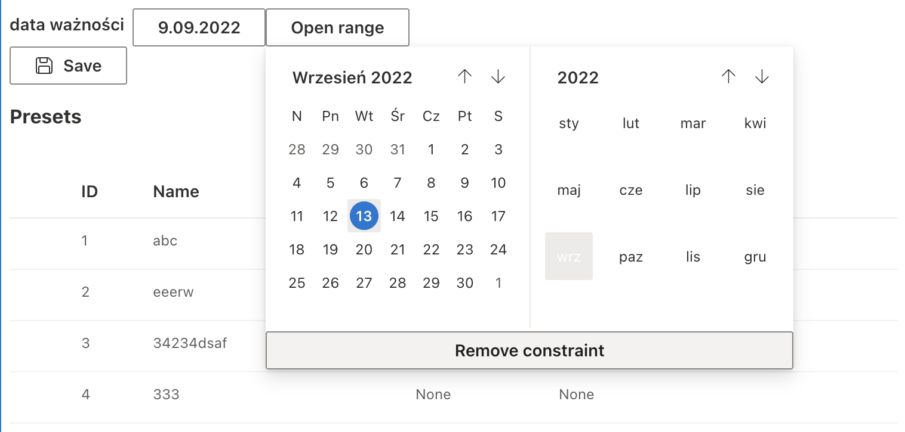

# SharePoint Framework experiments.

## Summary

This project is about learning SPFx and testing its selected features.

## Used SharePoint Framework Version

## Some Details

Project utilises FluidUI components in custom React components. React part is coded using functional components and hooks, maintaining the style of FluidUI documentation examples.

## Disclaimer

**THIS CODE IS PROVIDED _AS IS_ WITHOUT WARRANTY OF ANY KIND, EITHER EXPRESS OR IMPLIED, INCLUDING ANY IMPLIED WARRANTIES OF FITNESS FOR A PARTICULAR PURPOSE, MERCHANTABILITY, OR NON-INFRINGEMENT.**
